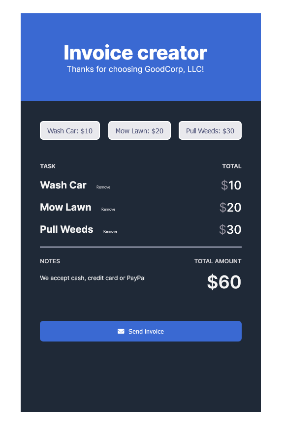

# invoice-generator
 
## Table of contents

  - [The challenge](#the-challenge)
  - [Screenshot](#screenshot)
  - [Links](#links)
  - [Author](#author)

### The challenge

Requirements:
1. Array to hold services requested;
2. Buttons to add services to array;
3. Place to display data from the array - updated every time the array changes;
4. Don't charge > once for the same service;
5. Total cost stays updated;
6. Button to "send invoice" (reset);
7. Stretch: remove items after adding.

### Screenshot

### Links

- Solution URL: https://github.com/gdcristea/invoice-generator

- Live Site URL: https://gdcristea.github.io/invoice-generator/

## Author

- Linkedin - [Daniel Cristea](https://www.linkedin.com/in/daniel-cristea-629069191/)

- Frontend Mentor - [@gdcristea](https://www.frontendmentor.io/profile/gdcristea)

- Twitter - [@gdcristea10](https://twitter.com/gdcristea10)
